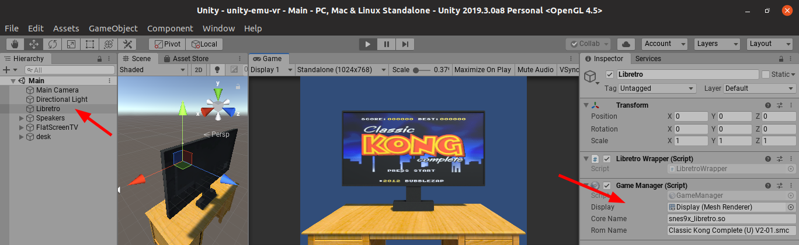

# RetroUnityFE

RetroUnityFE is a frontend for the **libretro API** built in **Unity 6+**.



## 📽️ Demo

[Watch WebM Video](https://gfycat.com/PresentUnconsciousAmberpenshell)

## 📖 Documentation

For detailed setup and usage instructions, see the [Wiki](https://github.com/Scorr/RetroUnity/wiki).

## 🎮 Tested Platforms

* [x] Linux
* [x] MacOS
* [x] Windows
* [x] Android
* [ ] iOS

## 📋 Features

* [ ] Savestate
* [ ] Rewind 

## 📂 External Assets

The following assets are used in this project:

- **[Flatscreen TV](https://assetstore.unity.com/packages/3d/props/electronics/flatscreen-tv-9721)** by Rutger Klunder
- **[Free Furniture Set](https://assetstore.unity.com/packages/3d/props/furniture/free-furniture-set-26678)** by Lef
- **[LibRetro for Linux](http://dimitry-i.blogspot.com/2013/01/mononet-how-to-dynamically-load-native.html)**

## 🔧 Setup Instructions

### 📁 Shared Library & ROMs

Place shared libraries and ROMs inside the `Assets/StreamingAssets/` folder.

### 🛠️ Install Dependencies (Linux)

```sh
sudo apt install libretro-snes9x libretro-snes9x-next
```

### 🎮 Running a Game

```sh
retroarch --libretro /usr/lib/libretro/snes9x_libretro.so "Classic Kong Complete (U) V2-01.smc"
```

## 🕹️ Tested Libretro Cores

The following cores have been tested and confirmed to work:

- **snes9x** (Super Nintendo)
- **blastem** (Sega Genesis)
- **nestopia** (Nintendo Entertainment System)
- **mgba** (Game Boy Advance)
- **mame2003_plus** (Arcade)
- **vecx** (Vectrex)
- **yabause** (Sega Saturn)

[Download latest cores](http://buildbot.libretro.com/nightly/apple/osx/arm64/latest/)

## 📚 References

- [SNES SDK](https://github.com/optixx/snes-sdk)
- [Classic Kong](https://github.com/nathancassano/classickong)
- [Flatscreen TV Asset](https://assetstore.unity.com/packages/3d/props/electronics/flatscreen-tv-9721)
- [Furniture Set Asset](https://assetstore.unity.com/packages/3d/props/furniture/free-furniture-set-26678)

---

🎮 **RetroUnityFE** is an open-source project that aims to bring a seamless frontend experience for **libretro** cores in Unity!

